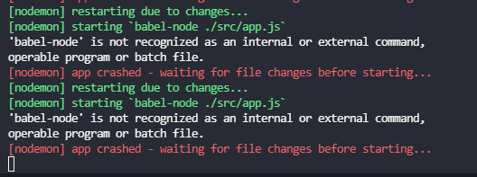

# Setup Babel
1. npm i --save-dev babel-cli babel-preset-env babel-preset-stage-0
2. create file .babelrc in root folder 

    `
        {
            "presets": ["env","stage-0"]
        }
    `
3. package.json

    `
        "script": "nodemon ./src/app.js --exec babel-node -e js" 
    `

>  
>   
> 
> run command line line : `npm i -g babel-node `